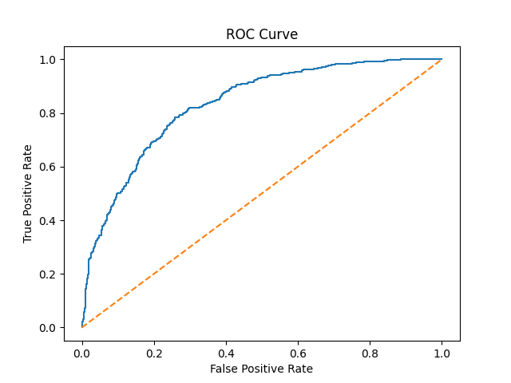

# Customer Churn Prediction — Business-Focused AI Project

## Business Problem:

Customer churn directly impacts revenue and profitability in subscription-based businesses.
Identifying customers who are likely to churn enables companies to take proactive retention measures.

The objective of this project is to build a predictive model that identifies high-risk customers and derive actionable business insights.

## Dataset:

- Source: Telco Customer Churn dataset
- Records: ~7,000 customers
- Features include:
    - Contract type
    - Monthly charges
    - Tenure
    - Internet service
    - Payment method
    - Customer demographics

## Project Workflow:

- Data Cleaning
    - Converted TotalCharges to numeric
    - Removed missing values
    - Dropped customerID (non-informative feature)
- Exploratory Data Analysis
    - Analyzed churn distribution
    - Identified high-risk segments
    - Examined contract type, tenure, payment method impact
- Feature Engineering
    - One-hot encoding for categorical variables
    - Binary mapping of churn target
- Model Building
    - Logistic Regression
    - Train-Test split (80-20)
    - Threshold tuning for improved recall
- Evaluation
    - Accuracy
    - Recall (Churn class)
    - ROC-AUC

## Model Performance:

- Accuracy: ~77%
- Recall (Churn class): 65% (after threshold tuning)
- ROC-AUC: ~0.83

The model demonstrates strong ability to distinguish churn vs non-churn customers.

##  ROC Curve

## Key Business Insights:

- Fiber optic customers show higher churn probability
- Month-to-month contracts are high risk
- Automatic payment methods reduce churn
- Customers using bundled services are more stable
- New customers (low tenure) are more likely to churn

## Strategic Recommendations:

- Incentivize long-term contracts through discounts
- Promote automatic payment enrollment
- Bundle additional services to increase stickiness
- Investigate service quality issues in fiber segment
- Target high-risk customers proactively using prediction model

## Business Impact:

By deploying this model, a company can:
- Identify high-risk customers early
- Reduce churn rate through targeted retention strategies
- Improve customer lifetime value
- Increase revenue stability

## Tech Stack:

- Python
- Pandas
- NumPy
- Scikit-learn
- Matplotlib / Seaborn

## Project Structure

business-ai-customer-churn/
│
├── data/
├── notebooks/
│   └── 01_eda.ipynb
├── src/
│   └── train_model.py
├── results/
├── requirements.txt
└── README.md
